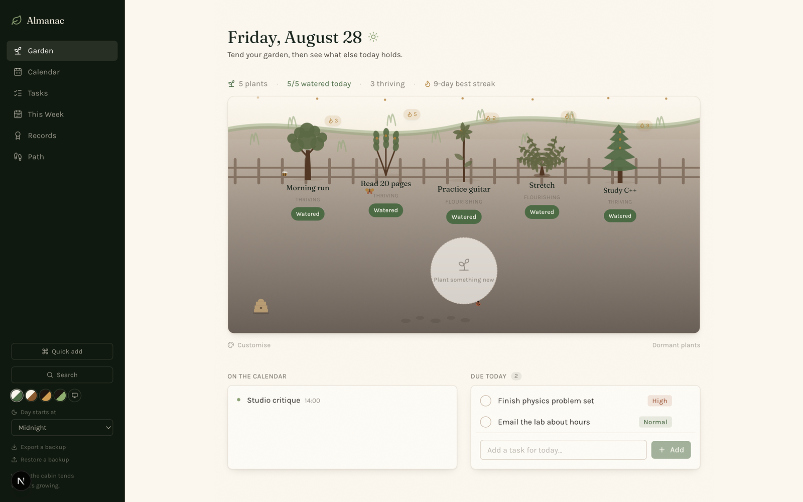
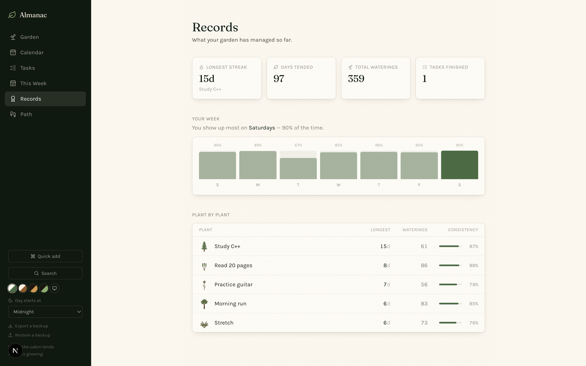
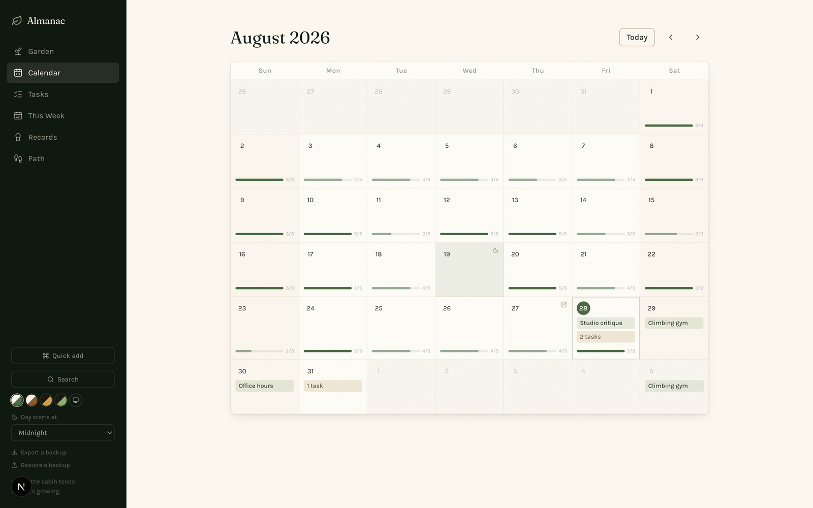

# Almanac

> Where the cabin tends what it's growing.

A habit tracker that grows a garden. Each habit is a plant whose species you choose and whose health reflects how consistently you've actually tended it — thriving when you show up, wilting when you don't. Calendar, tasks and records live in the same app, but the garden is the front door.



## The garden

Every habit is a plant. Water it and it grows; miss it and it starts to struggle. Health is a continuous blend rather than a handful of states, so a plant browns gradually instead of flipping between "good" and "bad".

Consistency earns **Growth**, the app's single progression currency:

| Source | Worth |
|---|---|
| A habit day finished | 1 |
| A perfect day — everything scheduled, done | 3 |
| Streak milestones at 7 / 30 / 100 / 365 days | 10 / 40 / 150 / 600 |
| Finishing a timed challenge | 2× its length |

Growth is never stored. It's recomputed from completion history every time it's read, so backfilling a day you forgot to log retroactively corrects everything downstream — including plants you'd already unlocked.

## The path

Growth advances you down a trail of 50 milestones that unlock plant species, ground styles, skies, ambiences, ornaments, critters and titles. You start with a handful of species and earn the rest. If a habit is somehow set to a species you haven't unlocked, it's quietly reassigned to one you have rather than showing something unearned.

## Everything else

- **Calendar** — month grid with events, tasks and a per-day bar of how much of the garden got tended, plus a journal note for any day.
- **Rest days** — mark a day off and it stops counting against you: streaks bridge it, consistency rates drop it from the denominator, and work you *do* on a rest day still earns Growth.
- **Timed challenges** — commit a habit to a 7/14/30/60/100-day run for bonus Growth. Progress is counted from completion history, and claiming one is verified server-side.
- **Records** — longest streaks, consistency rates, heatmaps per habit.
- **Search** (⌘/) and **quick capture** (⌘K).
- **Backup / restore** as plain JSON.
- Four themes, a configurable day-start hour for people who are up past midnight, and a `/api/summary` endpoint that The Lodge reads.





## A note on the data model

Nothing derived is ever cached. Growth, streaks, health, challenge progress and consistency rates are all computed from the completion table on read. It costs a little work per render and buys the guarantee that no two screens can ever disagree about the same number.

## Stack

Next.js 16 (App Router) · React 19 · TypeScript · Tailwind 4 · Prisma + SQLite.

## Running it

```bash
npm install
npx prisma db push
npm run dev
```

Then open <http://localhost:3001>. The database is created at `~/Library/Application Support/Almanac/almanac.db` — outside the repo, so it survives a clean checkout and is never committed.

See [docs/development.md](docs/development.md) before changing the schema.

## The cabin

Part of a set of local-first apps launched from [The Lodge](https://github.com/CamWhamBammus/the-lodge).
